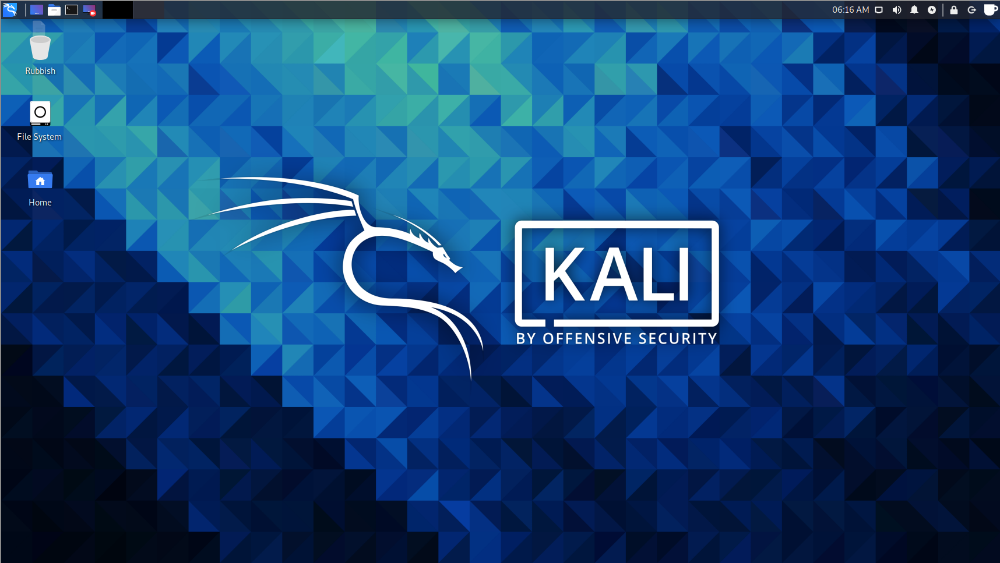
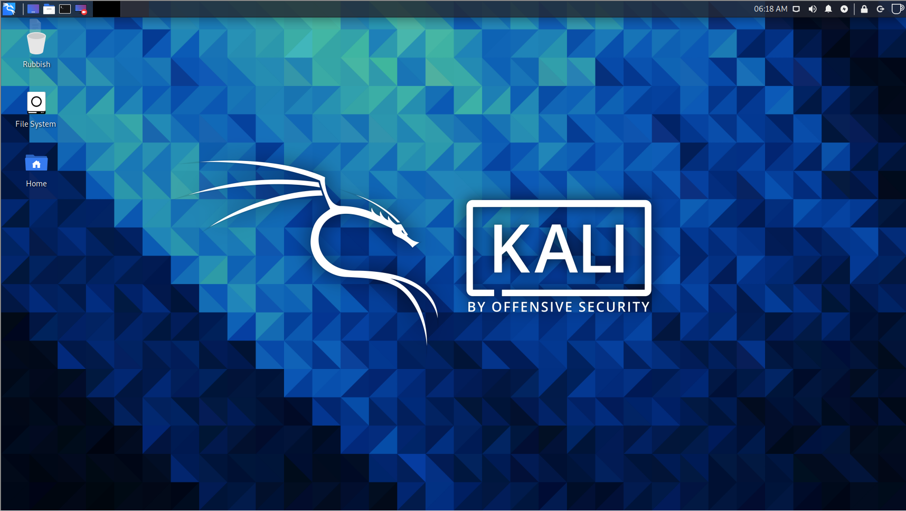

# XFCE-Coffee
An XFCE variant "and blatant rip off" of the popular caffeine gnome shell extension. When the launcher icon cup is full the auto suspend and screensaver are disabled, and are re-enabled when the cup is empty.
- - -

## Issues
There is an issue with the creation script that does not update the launcher image correctly, the band-aid fix was to re-copy the .desktop file after a two second delay. The creation script currently required `chmod +x create_coffee.sh` to make the creation script executable.

## Todo
* Add support to adjust the coffee app position within the creation script
* Add support for coffee app to be located on additional panels that may be present
* Add support to reset the coffee app to empty upon startup
* Remove the requirement for the user to need to use the `chmod` command
* Refactor the creation script
- - -
## Installation

    git clone https://github.com/CryptoMoogle/XFCE-Coffee.git
    cd XFCE-Coffee
    chmod +x create_coffee.sh
    ./create_coffee.sh
